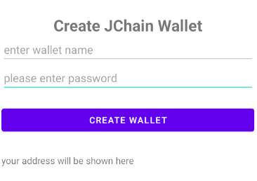

# android-blockchain-wallet
This repository is a custom blockchain wallet built in an android app based on Ethereum with Web3j and Infura

1- Firstly, you have to create a wallet, your address will be shown below

2- Secondly, you can connect to a node of your wallet network and check your balance

3- Finally, after getting some rinkeby faucet, you can send eth(wei)

All of these steps described at the top are respectively shown in the next screenshots

1-

2-

3-

